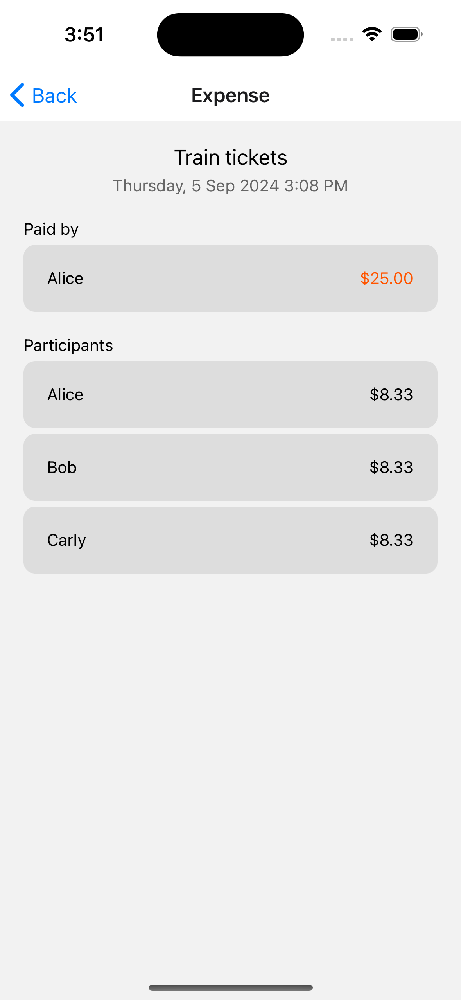

# SplitSmart

## About

SplitSmart is a mobile app developed using React Native and Firebase, designed to help users split expenses among friends, family and colleagues. It allows users to add expenses to a group, and the balances and suggested reimbursements are automatically calculated.

## Groups screen

When the app is run, the user lands on the Groups screen. Users can click on the "New Group" button to create a new group, or click on an existing group to manage its expenses.

## New Group screen

When the user clicks on the "New Group" button in the Groups screen, they are redirected to the New Group screen. Users can enter the title of the group and names of the participants to create a new group. Validation checks are put in place to detect invalid inputs, such as missing fields or duplicate participants.

## Group screen - expenses tab

When the user clicks on a group in the Groups screen, they are redirected to the Group screen. Users can click on the "Add Expense" button to add a new expense to the group, or click on an existing expense to view more details.

## Group screen - balances tab

When the user clicks on the "Balances" tab in the Group screen, they can view the balances of each participant calculated based on the expenses. Additionally, the screen displays the suggested reimbursements to settle the balances most efficiently.

## Add Expense screen

When the user clicks on the "Add Expense" button in the Group screen, they are redirected to the Add Expense screen. Users can enter the title and amount of the expense, the participant who paid for the expense and the participants sharing the expense to create a new expense. Validation checks are put in place to detect invalid inputs, such as missing fields or non-numeric/negative amount.

## Expense screen

When the user clicks on an expense in the Group screen, they are redirected to the Expense screen. Users can view details of the expense such as title, date time added, participant who paid, total amount, participants sharing the expense and their individual amounts.
